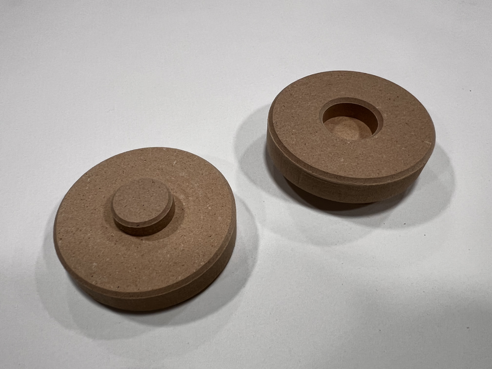

# MFT Pucks

Pucks to support material for a [Festool MFT/3 Table](https://www.festoolusa.com/accessories/sawing/underframes-and-work-benches/work-benches/495315---mft3).



## Tools and Materials

* CNC machine
* 3/4 inch MDF
* 1/4 inch end-mill, only absolutely required bit, good examples:
  * [Cadence Manufacturing "The Jenny"](https://www.cadencemfgdesign.com/product-page/the-jenny-bit-8675309)
  * [Woodpeckers US2102C](https://www.woodpeck.com/ultra-shear-quarter-inch-spiral-compression-bits.html)
* 90 deg v-bit for edge chamfers
  * [SpeTool W06007]([https://www.amazon.com/Amana-RC-45711-Insert-Carbide-Groove/dp/B003DCMDRU](https://spetools.com/products/spetool-w06007-v-groove-chamfer-router-bit-1-4-dia-1-4-shank-90-deg))
  
## Machining

### 90deg V-bit

* softens edges, makes feet easier to insert, adds label
* machine along the vectors
* layers ```Outlines and Feet Insets``` final depth 1mm
* layer ```Highline Woodworking``` 0.2mm (skip entirely if you don't want the text label or change to your own)

### 1/4 inch End-Mill

* cuts insets for feet and the final outline for the piece
* layer ```Feet Insets``` area clear inside the circles, final depth 8mm
* layer ```Outlines``` cut outside the vectors, 13.1mm final depth
  * add bridges or other supports
  * example bridges: 8 x 30mm long x 1mm thick

## Files

* base_v01.art = [Carveco Maker](https://carveco.com/carveco-software-range/carveco-maker/) source file
* base_v01.dxf = [DXF](https://en.wikipedia.org/wiki/AutoCAD_DXF) exported source file
* base_v01.dwg = AutoCad drawing file created with [Siemens Solid Edge 2D](https://resources.sw.siemens.com/en-US/download-free-2d-cad-software/)
* laser_grid.nc = [G-code](https://en.wikipedia.org/wiki/G-code) file to burn an alignment grid into the completed MDF base

## Dimensions


## Versions

* v01 | 10-Feb-2025 | inital post


